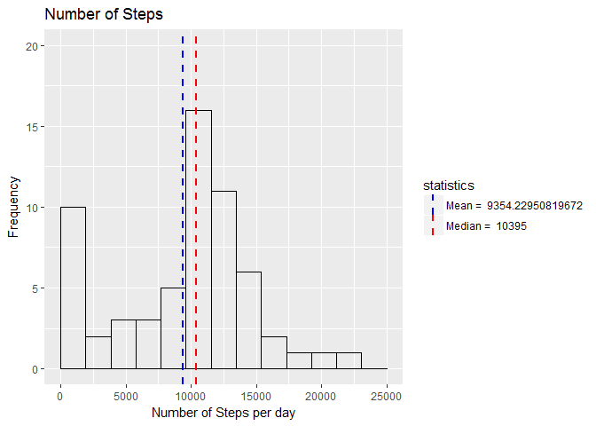
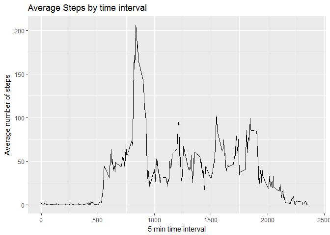

# Reproducible Research: Peer Assessment 1


## Loading and preprocessing the data


This assignment makes use of data from a personal activity monitoring
device. This device collects data at 5 minute intervals through out the
day. The data consists of two months of data from an anonymous
individual collected during the months of October and November, 2012
and include the number of steps taken in 5 minute intervals each day.


The data for this assignment can be downloaded from the course web
site:

* Dataset: [Activity monitoring data](https://d396qusza40orc.cloudfront.net/repdata%2Fdata%2Factivity.zip) [52K]

The variables included in this dataset are:

* **steps**: Number of steps taking in a 5-minute interval (missing
    values are coded as `NA`)

* **date**: The date on which the measurement was taken in YYYY-MM-DD
    format

* **interval**: Identifier for the 5-minute interval in which
    measurement was taken.

In the following code downloads, reads and processes the data into  **dataset**.


```r
library(dplyr)
```

```
## 
## Attaching package: 'dplyr'
```

```
## The following objects are masked from 'package:stats':
## 
##     filter, lag
```

```
## The following objects are masked from 'package:base':
## 
##     intersect, setdiff, setequal, union
```

```r
library(ggplot2)
setwd("~/[coursera]DataSciences/DataScienceSpecialisation/5_Reproducible_research/RepData_PeerAssessment1")
dataset <- tbl_df(read.csv("activity.csv", header= TRUE, sep = ","))
dataset <- dataset %>%
        mutate(date = as.Date(date,  "%Y-%m-%d"))%>%
        group_by(date)
```

The data frame **dataset** is grouped by **date** to facilitate the 
analysis performed in the next section.

## What is mean total number of steps taken per day?

We compute the total number of steps **numberOfSteps** taken per day and we summarise it in the data frame **nbSteps_days**. The mean and the median of the total number of steps **numberOfSteps** are respectively given by **meanOfSteps** and 
**medianOfSteps**


```r
nbSteps_days  <- summarise(dataset, numberOfSteps = sum(steps, na.rm=TRUE))
meanOfSteps   <-  mean(nbSteps_days$numberOfSteps, na.rm=TRUE)
medianOfSteps <- median(nbSteps_days$numberOfSteps, na.rm=TRUE)
```


Using the ggplot2 package, we plot the histogram of the number of steps 
per day as well as the mean and the median. The missing values have simply been removed from the analysis.


```r
median <- paste("Median = ", as.character(medianOfSteps))
mean <- paste("Mean = ", as.character(meanOfSteps))


q <- ggplot(nbSteps_days, aes(numberOfSteps))+ geom_histogram(col="black", fill= NA, alpha = 1 ,bins =14, boundary = 0) + 
        geom_vline(aes(xintercept=medianOfSteps, color= median), linetype="dashed", size=1) +
        geom_vline(aes(xintercept=meanOfSteps,   color= mean), linetype="dashed", size=1) +
        labs(title="Number of Steps") +
        labs(x="Number of Steps per day", y="Frequency") + 
        xlim(c(0, 25000)) + 
        ylim(c(0,20))+
        # scale_shape_discrete(labels = c("DDD", "EEE"))
        scale_color_manual(name = "statistics", values = c("blue", "red"))
                                                             
                                                            
print(q)
```

<!-- -->


## What is the average daily activity pattern?

We group the data frame **dataset** by **interval**
and we compute the average of steps for each 5 minutes interval.
The result is stored in **mean_Interval**.
We plot the time series of the 5-minute interval (x-axis) and the average number of steps taken, averaged across all days (y-axis).


```r
mean_Interval <- dataset %>%  group_by(interval) %>%
        summarise(meanByInterval = mean(steps, na.rm= TRUE))

q1 <- ggplot(mean_Interval, aes(interval ,  mean_Interval$meanByInterval) )+geom_line()+
        labs(title="Average Steps by time interval") +
        labs(x="5 min time interval", y="Average number of steps")+
        xlim(c(0, 2400)) 
print(q1)
```

<!-- -->

We look at the 5-minute interval, on average across all the days in the dataset, containing the maximum number of steps.
The result is contained in the first column of the data frame **intervalMax**


```r
intervalMax <- mean_Interval %>% filter(meanByInterval == max(meanByInterval))

print(intervalMax)
```

```
## # A tibble: 1 x 2
##   interval meanByInterval
##      <int>          <dbl>
## 1      835       206.1698
```


## Imputing missing values

Our strategy is to replace all the missing values in **steps** by its interval average.


```r
dataset <- dataset %>% group_by(interval) %>%
        mutate(steps= replace(steps, is.na(steps), mean(steps, na.rm=TRUE)))%>%
        group_by(date)%>% arrange(date)


nbSteps_days_noNA <- summarise(dataset, numberOfSteps = sum(steps))
meanOfSteps_noNA   <-  mean(nbSteps_days_noNA$numberOfSteps)
medianOfSteps_noNA <- median(nbSteps_days_noNA$numberOfSteps)
```

From the new dataset **nbSteps_days_noNA**, we build an histogram of the total number of steps per days when the missing values have been replaced.


```r
 median_noNA <- paste("Median = ", as.character(medianOfSteps_noNA))
 mean_noNA  <- paste("Mean = ", as.character(meanOfSteps_noNA))

 q2 <- ggplot(nbSteps_days, aes(numberOfSteps))+ geom_histogram(col="black", fill= NA, alpha = 1 ,bins =14, boundary = 0) + 
         geom_vline(aes(xintercept=medianOfSteps_noNA, color= median_noNA ), linetype="dashed", size=1) +
         geom_vline(aes(xintercept=meanOfSteps_noNA,   color= mean_noNA ), linetype="dashed", size=1) +
         labs(title="Number of Steps") +
         labs(x="Number of Steps per day", y="Frequency") + 
        xlim(c(0, 25000)) + 
        ylim(c(0,20))+
       # scale_shape_discrete(labels = c("DDD", "EEE"))
        scale_color_manual(name = "statistics", values = c("blue", "red"))

print(q2)
```

<!-- -->

We observe that the mean and the median have now the same values. It was expected as we replaced all the NAs by the corresponding average number of steps by interval.


## Are there differences in activity patterns between weekdays and weekends?
 
 We first build a function whichWeekDays that takes a date as inuput and returns "weekend" if the corresponding day is either "samedi" or "dimanche" (French). It returns "weekdays" if it corresponds to another day.

```r
# returns "weekend if the day is either saturday or Sunday (in French) or a week day" 
whichWeekDays <- function(x){
        if (x  == "samedi" || x==  "dimanche"){
                   return("weekend")  
        }
        return("weekdays") 
}
```


```r
# summarise dataset: according to date, days is either "weekend" or "weekdays".
# The function whichWeekDays is only called once for each date.
dat <- dataset %>% group_by(date)%>% summarise(nbdays = n()) %>% 
        rowwise()%>%mutate(days=whichWeekDays(weekdays(date)))

# replicate dat$days by the nb of entries of a date in dataset
# and add it to dataset as a factor variable
whichDayType    <- rep(dat$days, dat$nbdays)
dayType         <- tbl_df(as.data.frame(whichDayType, stringsAsFactors = TRUE))
dataset         <- bind_cols(dataset, dayType)
      

# mean by intervals and whichDayType
activityPattern <- dataset %>% group_by(interval, whichDayType)  %>%
                          summarise(mean = mean(steps)) 
```

Finally we plot the average number of steps taken, averaged across all weekday days or weekend days, contained in the database **activityPattern**


```r
q3 <- ggplot(data = activityPattern, aes(interval , mean)) +
        geom_line()+
        facet_grid(. ~ whichDayType )+
        labs(title="Average Steps by time interval and day type") +
        labs(x="5 min time interval", y="Average number of steps") 
print(q3)
```

<!-- -->

