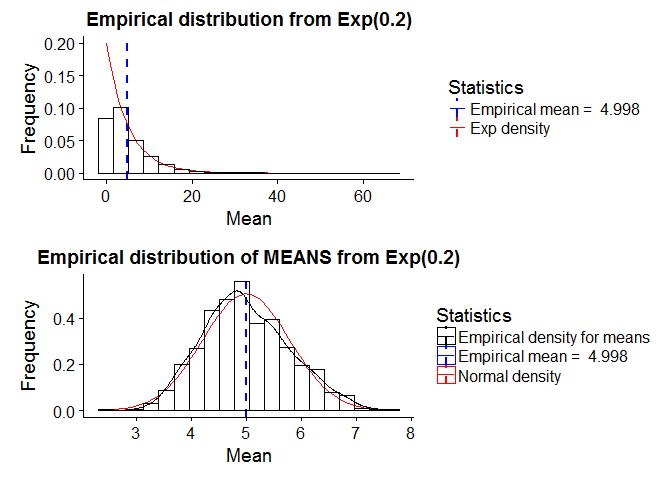

# Illustration of the Central Limit Theorem
M. Gazeau  
December 8, 2016  


## Synopsis
In this assignement we illustrate the central limit theorem and associated confidence intervals for empirical means. We consider **independant and identically distributed** random variables having exponential distribution with rate $\lambda =0.2$. The theoretical mean and the standard deviation are both equal to $5$.


## Illustration of the Central Limit Theorem
We sample $n=40$ independant random variables distributed according to $\mathcal{E}(0.2)$ and we compute its empirical mean and standard deviation. The central limit theorem tells us that the empirical mean approximatly follows a normal distribution (with mean = 5 and standard deviation = $5/\sqrt{40}$).
We repeat this procedure $m=1000$ times. This total sample will be used to determine the empirical distribution of the empirical means.


```r
library(tidyr)
library(dplyr)
library(ggplot2)
library(cowplot)

set.seed(1214435)

lambda <- 0.2  
n <- 40
m <- 1000
mu_theo <- 1/lambda
sigma_theo <- 1/lambda

## Draw n=40 random variables from Exponential distribution with rate lambda=0.2
## Compute the empirical mean and standard deviation from the samples
## Repeat the process m=1000 times
y  <- NULL
mu_emp  <- NULL
sd_emp <- NULL
for (i in 1 : m){
        x   <- rexp(n, lambda)
        y <- c(y, x)
        mu_emp <- c(mu_emp, mean(x))
        sd_emp <- c(sd_emp, sd(x))
}
```


### Empirical parameter values
We compare the empirical parameter values with their exact values.
From the strong Law of Large numbers, the empirical mean is expected to be close to the true value **5**. Indeed we found **4.99768**. Then we compute the mean of the empirical standard deviations of our sample. Again we found **5.008358** which is very close to the theoretical value.


```r
print(c(mean(y), mu_theo))
```

```
## [1] 4.99768 5.00000
```

```r
print(c(sd(y),sigma_theo))
```

```
## [1] 5.008358 5.000000
```

Finally we compute the standard deviation of the empirical means, given by **0.7952111** that we compare to its true value **$5/\sqrt{40} =  0.7905694$**. Again both values are close to each other.


```r
print(c(sd(mu_emp), sigma_theo/sqrt(n)))
```

```
## [1] 0.7952111 0.7905694
```


### Approximate distribution of sample means

We first plot the distribution of exponential random variables. Then, we plot the histogram of their means. On top is displayed both the approximate density for the means as well as the density function of the normal distribution (with mean = 5 and standard deviation = $5/\sqrt{40}$).


```r
mu <- mean(mu_emp)
mean_legend <- paste("Empirical mean = ", as.character(signif(mu,4)))


plot1 <- ggplot() + 
        geom_vline(aes(xintercept= mu_theo,   color= mean_legend), linetype="dashed", size=1) +
        stat_function(fun = dexp, aes(colour = 'Exp density'), args = list(rate= lambda))+
        geom_histogram(aes(y, y = ..density..), col="black", fill= NA, alpha = 1 ,bins = 20) +
        labs(title="Empirical distribution from Exp(0.2)") +
        labs(x="Mean", y="Frequency")+
        scale_color_manual(name = "Statistics", values = c("blue", "red"))
        
        
       

plot2 <- ggplot() + 
        geom_vline(aes(xintercept= mean(mu),   color= mean_legend), linetype="dashed", size=1) +
        stat_function(fun = dnorm, aes(colour = 'Normal density'), 
                      args = list(mean = mu_theo, sd = sigma_theo/sqrt(n)))+
        geom_histogram(aes(mu_emp, y= ..density..), col="black", fill= NA, alpha = 1 ,bins = 20) +
        geom_density(aes(mu_emp, color = "Empirical density for means"))+
        labs(title="Empirical distribution of MEANS from Exp(0.2)") +
        labs(x="Mean", y="Frequency")+
        scale_color_manual(name = "Statistics", values = c("black", "blue", "red"))
        

plot_grid(plot1, plot2, ncol = 1, align = 'v')
```

<!-- -->

## Conclusion
As a consequence of the CLT, the distribution of means of 40 exponential random variables (with rate 0.2) is approximatly a normal distribution with mean 5 and standard deviation $5/\sqrt{40}$. 
