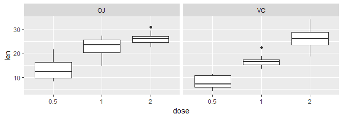

# Impact of Vitamin C on Guinea Pig's tooth growth
M. Gazeau  
December 8, 2016  


## Synopsis
In this assignement we use statistical hypothesis tests for mean difference to study the influence of two factors (dose and supp) on the tooth growth of guinea pigs.

## The ToothGrowth dataset
The **ToothGrowth** dataset contains measurement on the effect of Vitamin C on Tooth growth in Guinea Pigs. From the dataset description: "The response is the length of odontoblasts (cells responsible for tooth growth) in 60 guinea pigs. Each animal received one of three dose levels of vitamin C (0.5, 1, and 2 mg/day) by one of two delivery methods, (orange juice or ascorbic acid (a form of vitamin C and coded as VC)." It contains 60 observations on 3 variables: **len** (Tooth length), **supp** (Supplement type (VC or OJ)) and **dose** (Dose of vitamin C in milligrams/day).
Our goal is to determine from the data if the dose of Vitamin C (dose), the supplement type (supp) or both have on average an impact on the tooth length of Guinea Pigs.

## Tooth length by dose and supp
We first tidy our dataset grouping first by **dose** and then by **supp**. We display boxplot by dose and length for each of the supplement type. 
It clearly suggests that the average length of tooth increases with the dose of vitamine C. Moreover it also suggests that the method of administration does not influence the results.


```r
library(tidyr)
library(dplyr)
library(ggplot2)
TG_df <- group_by(ToothGrowth, dose= factor(dose), supp) %>% arrange(dose, supp, len)

plot3 <- ggplot(TG_df, aes(dose, len))+
        geom_boxplot()+
        facet_grid(.~supp)
print(plot3)
```

<!-- -->
To confirm our previous conclusions, we compute confidence intervals and p-values. The observations are assumed to be **independent**.
The supplement method doesn't seem to be important and we perform a t-test on the empirical means difference to corroborate this assumption:

* H_0: there is no difference in means between the two groups of different supplement type (VC or OJ)
* H_A: true difference in means is not equal to 0

We also assume here that both groups have **equal** variance. 


```r
data <- TG_df %>% group_by(supp) %>% 
        summarise(mean = mean(len), sigma= sd(len), n=n(), 
                  CI95inf = mean - qt(0.975, n-1)*sigma/sqrt(n), 
                  CI95sup = mean + qt(0.975, n-1)*sigma/sqrt(n))

print(data)
```

```
## # A tibble: 2 × 6
##     supp     mean    sigma     n  CI95inf  CI95sup
##   <fctr>    <dbl>    <dbl> <int>    <dbl>    <dbl>
## 1     OJ 20.66333 6.605561    30 18.19678 23.12989
## 2     VC 16.96333 8.266029    30 13.87675 20.04992
```

```r
t.test(len ~ supp, data =TG_df,  mu=0, paired= FALSE, conf.level=0.95, var.equal= TRUE)
```

```
## 
## 	Two Sample t-test
## 
## data:  len by supp
## t = 1.9153, df = 58, p-value = 0.06039
## alternative hypothesis: true difference in means is not equal to 0
## 95 percent confidence interval:
##  -0.1670064  7.5670064
## sample estimates:
## mean in group OJ mean in group VC 
##         20.66333         16.96333
```

The p-value is larger than the confidence level $0.05$ and therefore we fail to reject the null hypothesis. Moreover the confidence interval contains zero which is another indication that the true mean difference can be zero. 


We now test the impact on the dose of the tooth length. We group the data only with respect to the dose. The dataset **data** contains all necessary elements to perform our analysis on teeth's length: mean, standard deviation, number of observation and 95% confident interval for each dose.


```r
data <- TG_df %>% group_by(dose) %>% 
        summarise(mean = mean(len), sigma= sd(len), n=n(), 
                  CI95inf = mean - qt(0.975, n-1)*sigma/sqrt(n), 
                  CI95sup = mean + qt(0.975, n-1)*sigma/sqrt(n))

print(data)
```

```
## # A tibble: 3 × 6
##     dose   mean    sigma     n   CI95inf  CI95sup
##   <fctr>  <dbl>    <dbl> <int>     <dbl>    <dbl>
## 1    0.5 10.605 4.499763    20  8.499046 12.71095
## 2      1 19.735 4.415436    20 17.668512 21.80149
## 3      2 26.100 3.774150    20 24.333643 27.86636
```

From the dataset **data**, we observe that on average the length of teeth increases with the amount of Vitamin C given to the Guinea Pig. Moreover the standard deviation seems fairly constant among the three groups and the confidence intervals for each group do not overlap. As we are 95% confident that on average the true average length belong to those intervals, it seems very likely that an increase of Vitamin C results in an increase of teeth length. To validate this conclusion, we perform the following hypothesis tests:

* H_0: there is no difference in means between the groups (determined by the dose)
* H_A: true difference in means is not equal to 0

We assume **equal** variance between the groups. We compare the groups with dose 0.5 and 1 and the groups with dose 1 and 2. In both tests, the p-value is far below 0.05 which indicates that we reject the null hypothesis to accept the alternative hypothesis. 


```r
t.test(TG_df$len[21:40], TG_df$len[1:20],  mu=0,  paired= FALSE, conf.level=0.95,
       var.equal= TRUE)
```

```
## 
## 	Two Sample t-test
## 
## data:  TG_df$len[21:40] and TG_df$len[1:20]
## t = 6.4766, df = 38, p-value = 1.266e-07
## alternative hypothesis: true difference in means is not equal to 0
## 95 percent confidence interval:
##   6.276252 11.983748
## sample estimates:
## mean of x mean of y 
##    19.735    10.605
```

```r
t.test(TG_df$len[41:60], TG_df$len[21:40], mu=0,  paired= FALSE, conf.level=0.95,
       var.equal= TRUE)
```

```
## 
## 	Two Sample t-test
## 
## data:  TG_df$len[41:60] and TG_df$len[21:40]
## t = 4.9005, df = 38, p-value = 1.811e-05
## alternative hypothesis: true difference in means is not equal to 0
## 95 percent confidence interval:
##  3.735613 8.994387
## sample estimates:
## mean of x mean of y 
##    26.100    19.735
```


## Conclusion
From the data, there are not enough evidence to conclude that the supplement type (VC or OJ) has a role on the tooth's length. On the contrary, the tests suggest that an increase of vitamin C would result in an increase ofaverage teeth's length.
